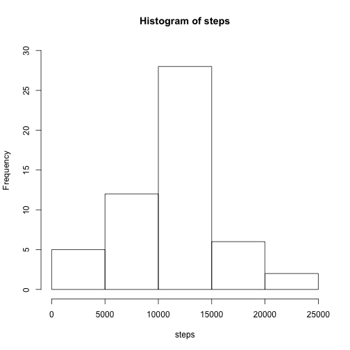
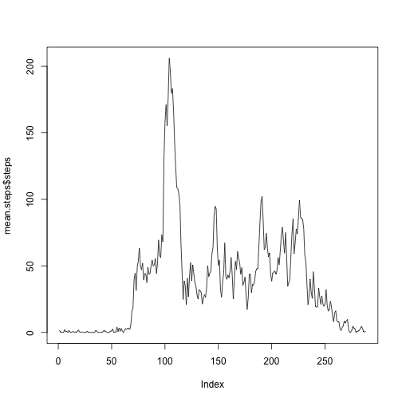
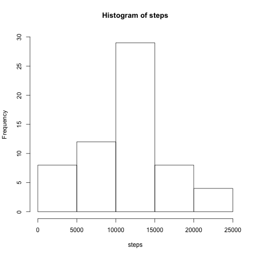
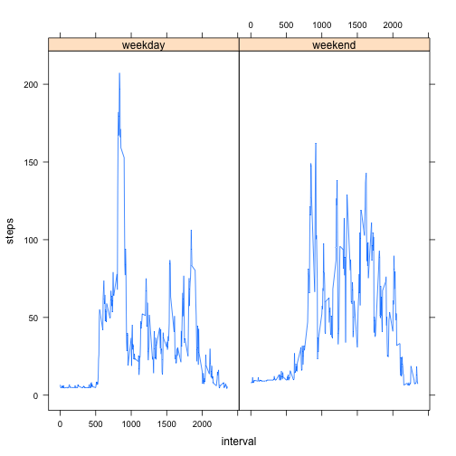

# Loading and preprocessing the data


```r
        library(dplyr)
        # load file
        activity <- read.csv("activity.csv", na.strings="NA")
```

# What is mean total number of steps taken per day?

1 - Total number of steps per day


```r
        # select only steps and date columns
        steps_date <- subset(activity, , select = c("steps", "date"))        
        sum.steps <- steps_date %>% group_by(date) %>% summarise_each(funs(sum))
```
2 - Histogram fo the total number of steps taken per day


```r
        hist(sum.steps$steps, main = paste ("Histogram of steps"), xlab = "steps", ylim = c(0,30))
```

 

3.a - Mean of the total number of steps taken per day  

```r
        mean(sum.steps$steps, na.rm = TRUE)
```

```
## [1] 10766.19
```

3.b - Median of the total number of steps taken per day  

```r
        median(sum.steps$steps, na.rm = TRUE)
```

```
## [1] 10765
```

# What is the average daily activity pattern?

1 . A time serie plot of the 5 minute interval and the average number of steps taken


```r
        steps_interval <- subset(activity, , select = c("steps", "interval"))
        mean.steps <- steps_interval %>% group_by(interval) %>% summarise_each(funs(mean(., na.rm = TRUE)))
        with(mean.steps, plot(mean.steps$steps,type = "l"))
```

 

2 . The maximum number of steps 


```r
max(mean.steps$steps)
```

```
## [1] 206.1698
```

# Inputing missing values

1 . Number of missing values in the dataset


```r
 sum(is.na(activity$steps))
```

```
## [1] 2304
```

2 . Strategy for filling in tha all of the missing values in dataset.   
        I used the mean for that 5-minute interval
        
3 . New dataset with the missing data filled in.


```r
        activity2 <- activity
        merged <- merge(activity2, mean.steps, by = "interval")
        for ( i in 1:nrow(activity2)) {
                if (is.na(activity2$steps[i]) == TRUE) {
                        activity2$steps[i] = merged$steps.y[i]
                }
        }
```

4 . Histogram of the total number of steps taken each day


```r
  steps_date2 <- subset(activity2, , select = c("steps", "date"))
        sum.steps2 <- steps_date2 %>% group_by(date) %>% summarise_each(funs(sum))
        
        hist(sum.steps2$steps, main = paste ("Histogram of steps"), xlab = "steps", ylim = c(0,30))
```

 

Mean

```r
        mean(sum.steps2$steps, na.rm = TRUE)
```

```
## [1] 10889.8
```

Median

```r
        median(sum.steps2$steps, na.rm = TRUE)
```

```
## [1] 11015
```

Mean and Mediana increased


# Are there differences in activity patterns between weekdays and weekends?

1 . New factor indicationg whether is a weekday or a weekend day


```r
        library(lubridate)
        for ( i in 1:nrow(activity2)) {
                if (wday(ymd(activity$date[i])) == 1 ) {
                        activity2$weekday[i] = "weekend"
                } else
                        if (wday(ymd(activity$date[i])) == 7 ) {
                                activity2$weekday[i] = "weekend" 
                        } else
                                activity2$weekday[i] = "weekday"
        }
```

2 . Time serie plot 


```r
        library(lattice)
        steps_date3 <- subset(activity2, , select = c("steps", "interval", "weekday"))
        mean.steps3 <- steps_date3 %>% group_by(interval, weekday) %>% summarise_each(funs(mean))
        xyplot(steps ~ interval | weekday, data = mean.steps3, type = "l")
```

 


